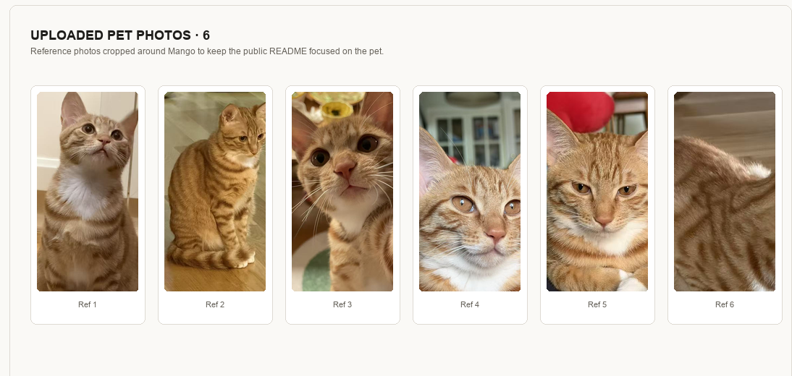
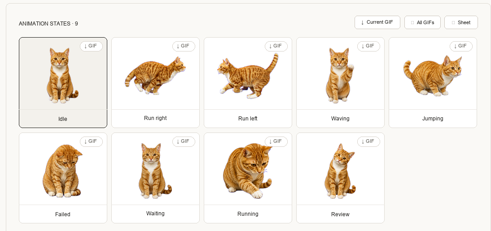

# Realistic Codex Pet

把 3-6 张宠物照片做成写实风格的 Codex 自定义 pet，并生成可直接安装到 Codex Desktop 的 `pet.json` + `spritesheet.webp`。

这个仓库包含一个 Codex skill：

```text
skills/realistic-codex-pet/
  SKILL.md
  agents/openai.yaml
  scripts/
    patch_realistic_prompts.py
    set_default_pet.py
```

## 能做什么

- 根据用户上传的 3-6 张宠物照片，生成写实 compact sprite 风格的 Codex pet。
- 输出标准 Codex pet 包：`pet.json` 和 `spritesheet.webp`。
- 验证 atlas 尺寸和每个动作行的帧数。
- 生成后把该 pet 设置为 Codex 当前默认 pet。
- 引导用户上传到 [Codex Pets](https://codex-pets.net/#/upload) 共享。

## 示例效果

### 上传图片



### Codex 截图


### 完整 9 个 animation states



## 安装

推荐直接让 Codex 安装：

```text
帮我安装 https://github.com/yinijin-shopeedev/realistic-codex-pet
```

如果要手动安装，可以使用 Codex 自带的 skill installer：

```bash
/usr/bin/python3 "$HOME/.codex/skills/.system/skill-installer/scripts/install-skill-from-github.py" \
  --repo yinijin-shopeedev/realistic-codex-pet \
  --path skills/realistic-codex-pet
```

也可以手动复制：

```bash
mkdir -p "${CODEX_HOME:-$HOME/.codex}/skills"
cp -R skills/realistic-codex-pet "${CODEX_HOME:-$HOME/.codex}/skills/realistic-codex-pet"
```

## 前置条件

- Codex Desktop。
- 可用的图像生成能力。
- 本地有 `hatch-pet` 相关脚本，默认路径为：

```text
${CODEX_HOME:-$HOME/.codex}/vendor_imports/skills/skills/.curated/hatch-pet
```

- Python 需要能运行 `hatch-pet` 脚本。如果默认 `python3` 缺少 Pillow，可以用 `CODEX_PET_PY` 指定已有解释器：

```bash
export CODEX_PET_PY="/abs/path/to/python"
```

## 使用

安装后，在 Codex 里上传 3-6 张宠物照片，然后直接说：

```text
使用 $realistic-codex-pet，帮我把这些照片做成写实版 Codex pet，名字叫 mango
```

最终产物会安装到：

```text
${CODEX_HOME:-$HOME/.codex}/pets/<pet-id>/
  pet.json
  spritesheet.webp
```

skill 会在验证通过后把默认 pet 设置为：

```text
custom:<pet-id>
```

如果 Codex 正在运行但界面没有立刻换 pet，重启或 reload Codex 即可刷新内存里的状态。

## 上传到 Codex Pets

生成完成后，打开：

[https://codex-pets.net/#/upload](https://codex-pets.net/#/upload)

上传以下两个文件：

```text
${CODEX_HOME:-$HOME/.codex}/pets/<pet-id>/pet.json
${CODEX_HOME:-$HOME/.codex}/pets/<pet-id>/spritesheet.webp
```

真实宠物建议选择 kind：`animal`。Tags 可选，例如：`animal`、`realistic`、`cat`、`dog`、宠物名字。

## 注意

- 这个 skill 会把用户照片作为身份参考交给图像生成流程；请只上传你有权使用的照片。
- 默认 pet 的选择依据是 pet 包目录名，不是 `pet.json` 里的 `id` 字段。
- `set_default_pet.py` 会在写入 `~/.codex/.codex-global-state.json` 前自动创建备份。
